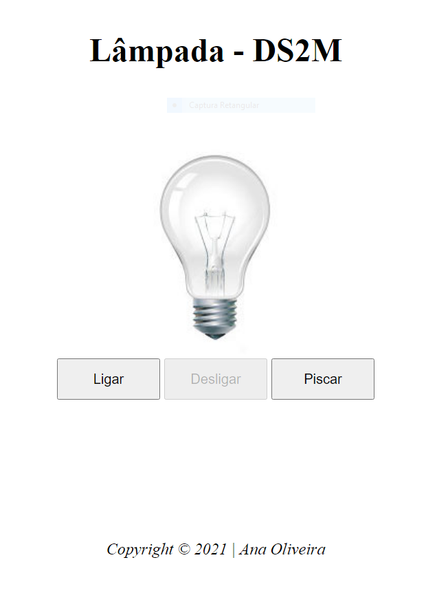

# LÂMPADA 
Projeto criado com objetivo didático para as aulas de PWFE do curso de Desenvolvimento de Sistemas do [SENAI Jandira](https://jandira.sp.senai.br/), sobre orientação do professor Fernando Leonid.
O projeto consiste em criar uma lâmpada que tenha três ações:
* Ligar
* Desligar
* Quebrar

Todo o código foi construído seguindo as boas praticas, com responsabilidade única e funções puras.

[Linkedin](https://www.linkedin.com/in/ana-ara%C3%BAjo-677592212) da desenvolvedora!

